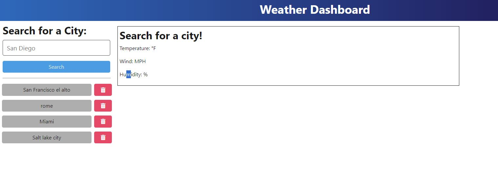

# Weather app

## Description
https://b3hold23.github.io/weather-app/ (Link to deployed URL is not working correctly. You can go down to the Test section to see it in action!)
 
This site will display the current weather and a 5 day forecast of the city. It will also save the history of the cities you have put in and you have the option to delete them. 

## Table of Contents
- [Installation](#installation)
- [Usage](#usage)
- [Credits](#credits)
- [License](#license)
- [Features](#features)
- [Contribute](#contribute)
- [Tests](#tests)

## Installation
To install this project for you computer you can go to the repo of this project:  https://github.com/b3hold23/weather-app/tree/main  Once you have gone to this link you can clone down the repo or download the zip file. Once it is downloaded you can open a terminal to the server file and run "npm run build". After that you can run "npm run dev". This will open the site for you to be able to use it. 

## Usage

## Credits

## License

  

## Features
A great feature on this site is that you can get the history of the cities you have looked up and you can delete the history as well. Look at the image below to see this feature. 
 
Other features is has is that it will tell you the temp of the city you look up. I am using an API to achieve this. The code is getting the name of the city from the user and it will fetch the api request and get the info of that city. Then the code will render the html page to display this information. 

## Contribute

## Tests
below you will see a test showing how the site is opened and how to use it. 
 
https://youtu.be/DeIitSwCbms?si=kwEt_oI2VgZS3BpS

## My Info
My github:
 
b3hold23 https://github.com/b3hold23
 
My email: rosa.angel.daniel@gmail.com
